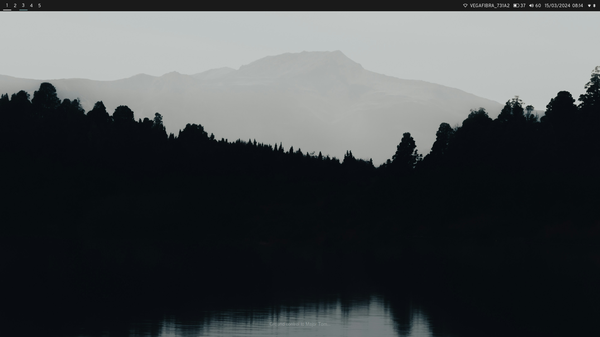
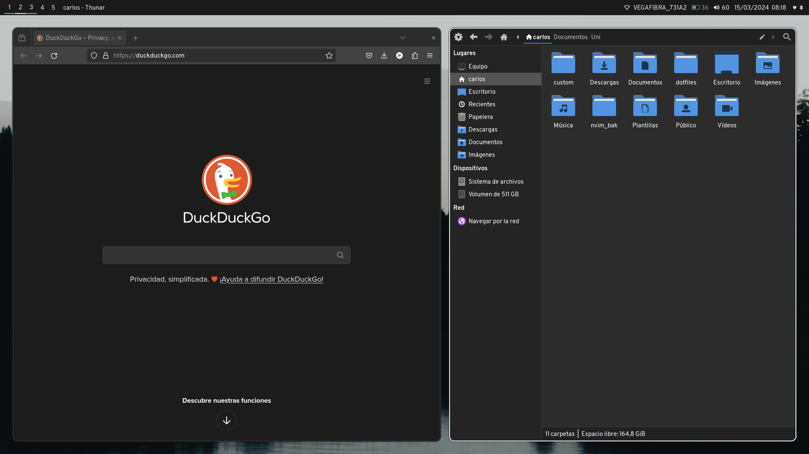

# Pineedaa's dotfiles
## Screenshots




# Apps

- OS: [ArchLinux](https://archlinux.org/)
- WM: [Hyprland](https://hyprland.org/)
- Terminal: [Alacritty](https://alacritty.org/)
- File explorer: [Thunar](https://wiki.archlinux.org/title/Thunar)
- Menu: [Wofi](https://github.com/fuzzybritches0/wofi)
- Shell: [Zsh](https://www.zsh.org/)
- Fetch: [Flowetch](https://github.com/migueravila/Flowetch)

The necessary packages for this environment can be installed with:
```
yay -S alacritty \n # Terminal
bluez \n # Bluetooth
blueman \n # Bluetooth applet
bc \n # For flowetch
brightnessctl \n # Keybind for brightness
dunst \n # Notifications
epapirus-icon-theme \n # The icon pack
eza \n # For the .zshrc
grim \n # Screenshoter
hypridle \n
hyprland \n
hyprlock \n
hyprpaper \n
network-manager-applet \n # For the waybar
orchis-theme \n # Theme
slurp \n # Screenshots
waybar \n # Bar
wl-clipboard \n # Clipboard
wlsunset \n # Day/night gamma adjustments
wofi # Menu
```

# Theme

The theme I chose is [orchis-dark-compact](https://aur.archlinux.org/packages/orchis-theme) and it can be installed with [yay](https://aur.archlinux.org/packages/yay):

`$ yay -S orchis-theme`

And the icon pack is [papirus]() that can be installed with pacman:
`$ pacman -S epapirus-icon-theme`

The theme and icon pack can be applied with the [nwg-look](https://archlinux.org/packages/extra/x86_64/nwg-look/) package.


# Install

You can clone this dotfiles where you prefere and inside the folder you can simply execute `stow .`.
You can install the [stow](https://www.gnu.org/software/stow/manual/stow.html) package with pacman.
